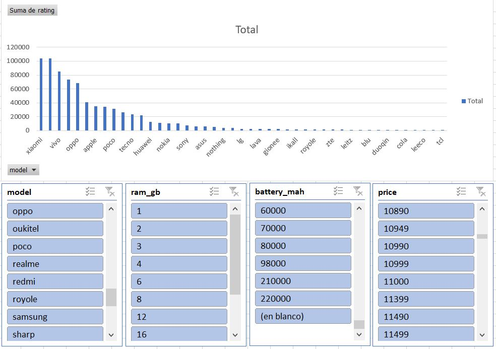

# 📱 Smartphone Market Analysis: ETL & Dashboard en Excel

## 📌 Descripción del Proyecto
Este proyecto consiste en un análisis exhaustivo de un dataset de especificaciones de smartphones. El objetivo principal fue aplicar un flujo de trabajo **ETL (Extract, Transform, Load)** para limpiar datos técnicos complejos y transformarlos en un dashboard interactivo que facilite la toma de decisiones basada en la relación costo-beneficio.

## 🛠️ Proceso ETL (Power Query)
La parte más crítica del proyecto fue la transformación de datos crudos mediante **Power Query**, donde se realizaron las siguientes acciones:

* **Extracción:** Conexión directa al dataset original en formato CSV para asegurar la escalabilidad.
* **Limpieza de Datos (Data Wrangling):**
    * Eliminación de unidades de medida (ej. "GB", "mAh") en columnas de RAM, Almacenamiento y Batería para convertirlas en valores numéricos.
    * Estandarización de marcas (Normalización de nombres).
    * Filtrado de columnas irrelevantes (VoLTE, SIM type, etc.) para optimizar el rendimiento del archivo.

## 📊 Análisis e Insights
A través de Tablas Dinámicas y Modelado de Datos, se extrajeron las siguientes conclusiones:

1. Identificación de qué marcas dominan cada segmento del mercado.
2. Xiaomi domina el mercado con su fuerte en un rango de memoria RAM de 2 a 12 GB.
3. Samsung se posiciona como 2da solo detras de xiaomi en el mismo rango de memoria RAM.

## 🖥️ Dashboard Interactivo
El archivo final incluye un tablero de control con:
* **Slicers (Segmentadores):** Filtrado instantáneo por Marca, RAM, Bateria y Precio.
* **Gráficos Dinámicos:** Visualización en tiempo real de las tendencias del mercado.

## 🚀 Dataset obtenido de kaggle: https://www.kaggle.com/datasets/devgondaliya007/smartphone-specifications-dataset
* **Microsoft Excel**
* **Power Query** (Motor de transformación)
* **Tablas y Gráficos Dinámicos**
